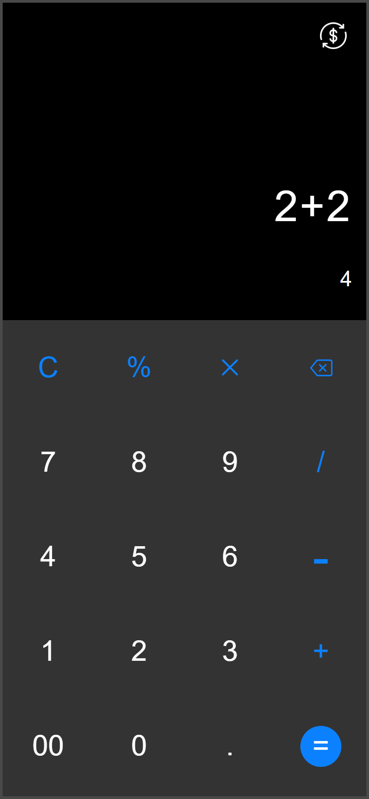

# 🧮💱 Calculator & Currency Converter Web App

A **sleek two-in-one web app** featuring a **smart calculator** 🤖 and **real-time currency converter** 🌍, built with vanilla JavaScript.


---

## ✨ Key Features

### 🧮 **Calculator Page**

- 🚨 **Regex-powered input validation** → Blocks invalid math expressions
- 🔄 **Real-time evaluation** → See results as you type (`2+2=` shows `4` instantly)
- 🗑️ **Smart deletion** → `DEL` button removes chars without breaking logic
- 🚦 **Error prevention** → Stops invalid submits like `5+/`
- 📱 **Custom keypad**



### 💰 **Currency Converter Page**

- 🌐 **160+ currencies** with live rates via [ExchangeRate-API](https://www.exchangerate-api.com/)
- 🔄 **One-click swap** ↔️ between currencies
- 📱 **Mobile-friendly keypad** → No annoying keyboard popups!
- 📡 **Offline-friendly** → Shows helpful errors when offline
- 🏷️ **Dynamic descriptions** → Shows full currency names (USD → US Dollar)


---

## 🛠️ Tech Stack

| Frontend                                                                                  | API                                                                                  | Magic                                                                                              |
| ----------------------------------------------------------------------------------------- | ------------------------------------------------------------------------------------ | -------------------------------------------------------------------------------------------------- |
|  |  |                                      |
|     |                          |  |
|                   |                |                            |

---

## 🚀 Installation

```bash
git clone https://github.com/Obiorakingsley/currency-calculator.git
cd currency-calculator
# No dependencies! Just open index.html 🎉
```
